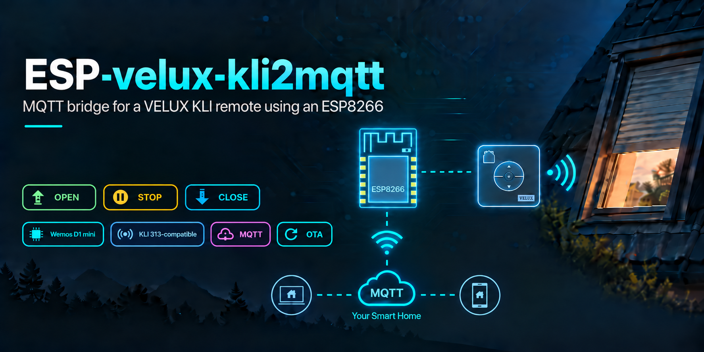

# ESP-velux-kli2mqtt



An ESP8266 adds MQTT inputs to a paired VELUX KLI remote. It does not speak
io-homecontrol: the KLI remains the radio endpoint. The ESP only closes the
three button contacts for OPEN, STOP and CLOSE.

## Scope

This repository documents one installed KLI 313-compatible reference build:
a Wemos D1 mini, a USB-powered KLI and three open-drain button inputs. It is
not a compatibility statement for every KLI PCB revision. Inspect and meter
the target board before soldering or applying power.

The bridge reports that it accepted a command and pulsed a contact. It cannot
report shutter movement or position. Any UI state in FHEM, HomeKit or Alexa is
therefore command history, not feedback.

## Hardware

The reference build is a Wemos D1 mini, a paired KLI 313-compatible remote,
three 10 kOhm pull-ups and USB power. Its electrical mapping, BOM, build photos
and assembly notes are in [Hardware](docs/HARDWARE.md).

The 3D-printed [replacement back cover](https://www.thingiverse.com/thing:6427196)
used by the reference build is also by Chris Bue.

## Build and USB flash

Install the ESP8266 board package and [PubSubClient](https://github.com/knolleary/pubsubclient), then create the local configuration file:

```powershell
Copy-Item firmware\velux_kli2mqtt\secrets.example.h firmware\velux_kli2mqtt\secrets.h
# Edit secrets.h locally.
powershell -ExecutionPolicy Bypass -File .\scripts\build.ps1
powershell -ExecutionPolicy Bypass -File .\tests\run-static-checks.ps1
```

The resulting image is `bin/esp-velux-kli2mqtt-<version>.bin`. Find the board
before flashing.

```powershell
& 'C:\Program Files\Arduino IDE\resources\app\lib\backend\resources\arduino-cli.exe' board list --json
powershell -ExecutionPolicy Bypass -File .\scripts\flash-usb.ps1 -Port COMx
```

Serial output is 115200 baud. The MQTT, OTA and serial helpers prompt for
credentials or read a Windows DPAPI-protected credential kept outside this
repository.

## MQTT topics

`VK_MQTT_ROOT_TOPIC` in the local `secrets.h` defaults to `velux/rollladen`.

| Topic                     | Direction   | Retained | Payload                       |
| ------------------------- | ----------- | --------:| ----------------------------- |
| `<root>/set`              | to device   | no       | `OPEN`, `STOP`, `CLOSE`       |
| `<root>/ota/set`          | to device   | no       | `ENABLE`, `CANCEL`            |
| `<root>/availability`     | from device | yes      | `online`, `offline`           |
| `<root>/last_command`     | from device | yes      | Last accepted button press    |
| `<root>/rssi_dbm`         | from device | yes      | Wifi RSSI                     |
| `<root>/firmware_version` | from device | yes      | Installed firmware version    |
| `<root>/ota/status`       | from device | yes      | OTA state                     |
| `<root>/ota/upload_url`   | from device | yes      | Upload URL while OTA is armed |

Do not retain either command topic. During a pulse or the 700 ms cooldown,
OPEN and CLOSE are ignored; STOP replaces a pending movement command.

```powershell
powershell -ExecutionPolicy Bypass -File .\scripts\mqtt-client.ps1 -Action Publish -Topic velux/rollladen/set -Message OPEN
powershell -ExecutionPolicy Bypass -File .\scripts\mqtt-client.ps1 -Action Read -Topic velux/rollladen/#
```

## OTA and trust boundary

OTA is disabled after boot. `ota-upload.ps1` opens a 60-second HTTP upload
window through MQTT, uploads a compatible image, then waits for the retained
firmware version and availability state. There is no separate HTTP password.

Run this only on a network you control: protect the broker credentials, limit
publisher access to the device topics, and do not expose the device or broker
to the internet. USB flashing is the recovery path. See [SECURITY.md](SECURITY.md).

```powershell
powershell -ExecutionPolicy Bypass -File .\scripts\ota-upload.ps1
```

## FHEM, HomeKit and Alexa

The full [FHEM integration template](docs/FHEM.md) is part of this repository.
It includes an `MQTT2_DEVICE`, the optional HomeKit mapping and Alexa notes.
Replace the device, broker, room, group and topic names before importing it.
The optional 0/100 slider is only a two-button UI adapter; it is not a position
control or a source of position feedback. A notify resets the displayed command
state to `idle` after 30 seconds.

## Further reading

- [Hardware: wiring, BOM and installed reference build](docs/HARDWARE.md)
- [FHEM, HomeKit and Alexa template](docs/FHEM.md)
- [Security policy](SECURITY.md)
- [Contributing](CONTRIBUTING.md)
- [Changelog](CHANGELOG.md)

## Credits

The KLI contact layout was checked against Chris Bue's
[KLI 313 ESP8266 project](https://www.chrisbue.de/velux-esp8266-smart-home-mqtt/).
This project uses the ESP8266 Arduino Core, PubSubClient and GitHub Actions
with `arduino/setup-arduino-cli` for compile validation.

Initial implementation and documentation were created with OpenAI Codex.

## License

MIT. See [LICENSE](LICENSE).
