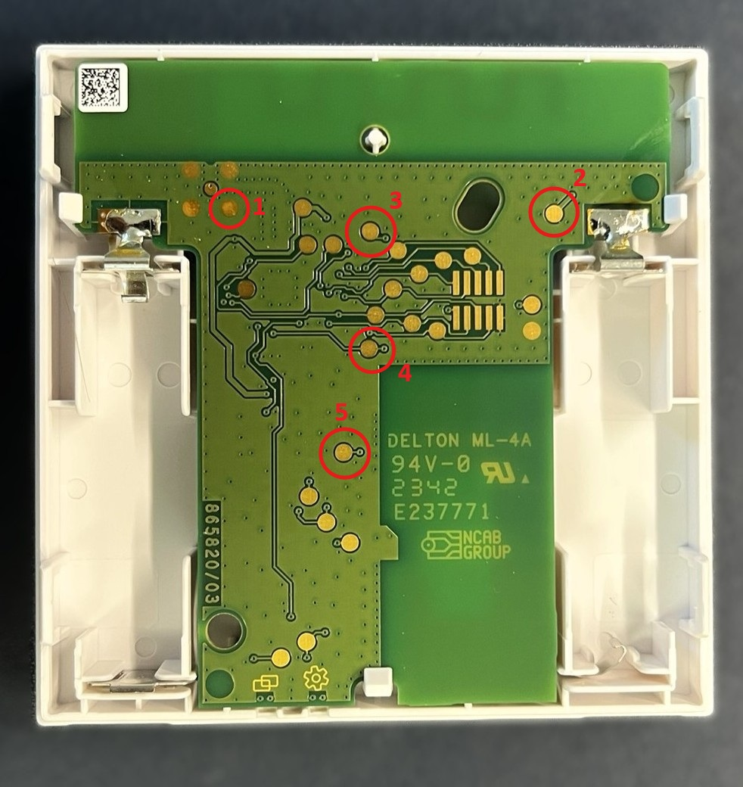
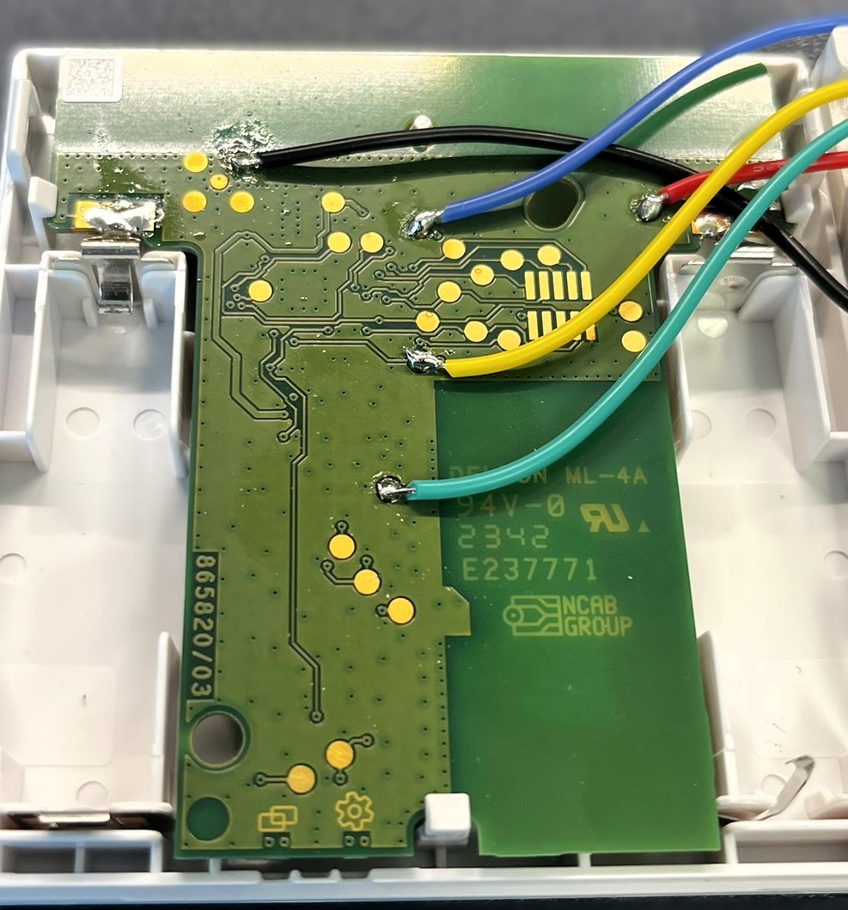
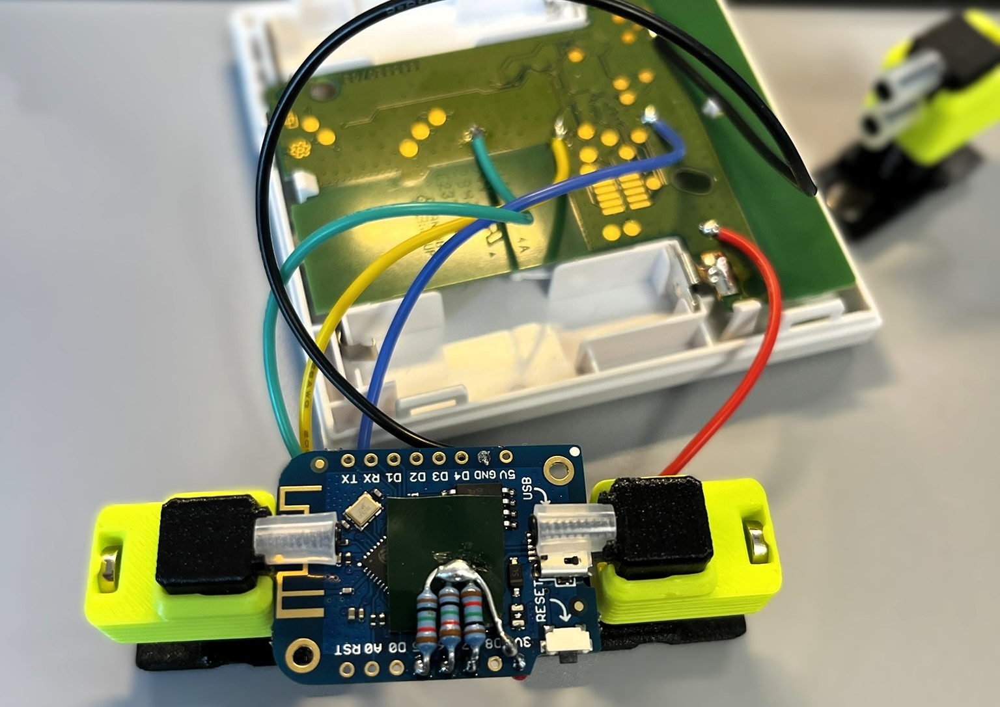
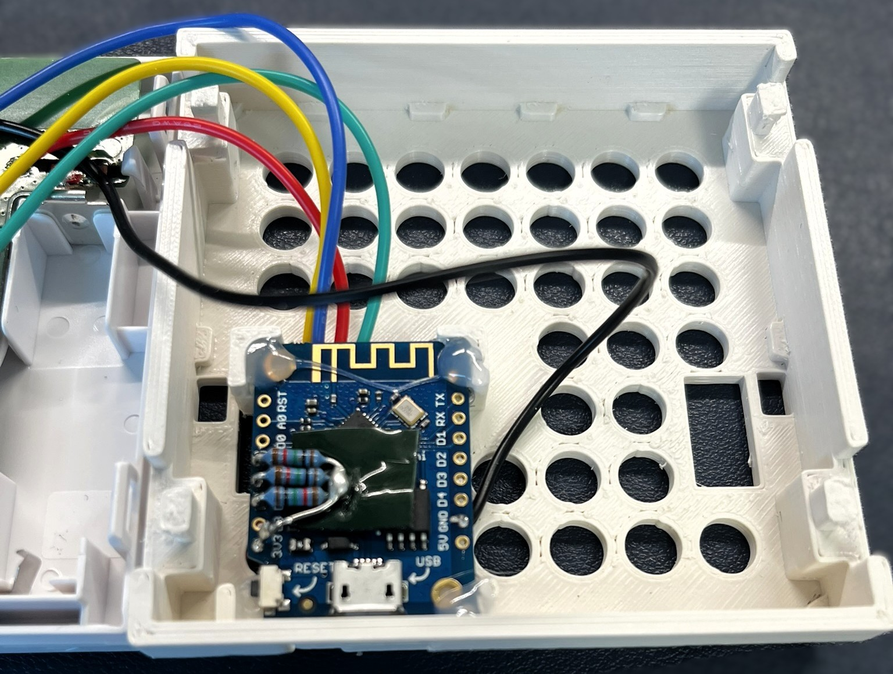
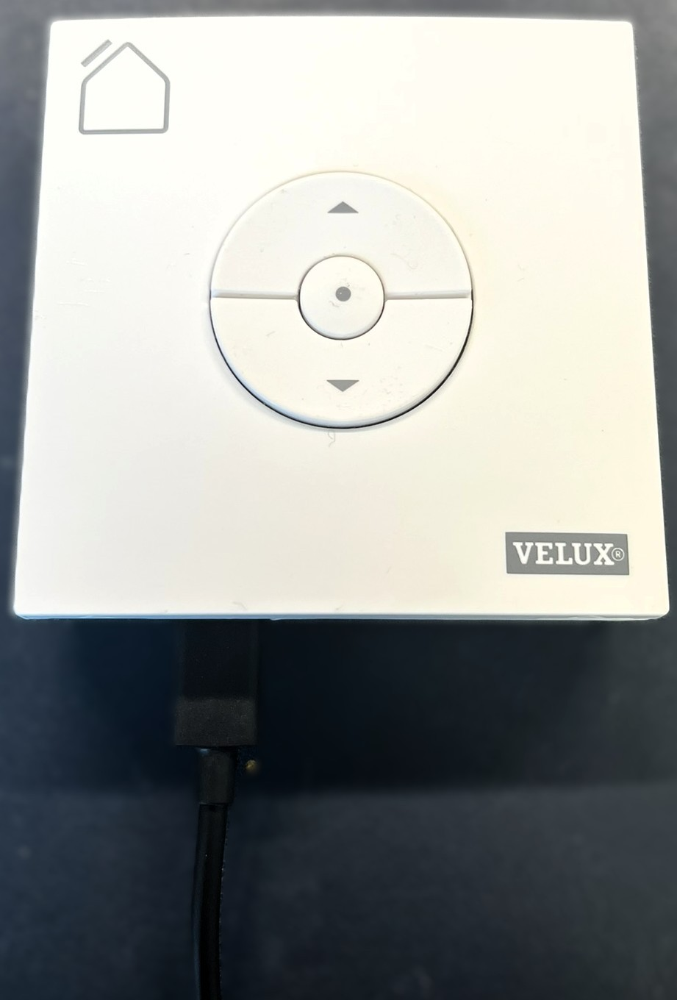

# Hardware

This document combines the electrical reference and the photographed build.
It applies to the KLI 313-compatible remote shown here, not automatically to
other KLI PCB revisions. Verify every target contact with a meter before
soldering.

Disconnect USB power and remove the KLI batteries before working on the board.
This build supplies the KLI from the Wemos 3V3 rail after assembly.

## Parts

| Quantity | Part                                      | Notes                                  |
| --------:| ----------------------------------------- | -------------------------------------- |
| 1        | Wemos D1 mini or ESP8266-compatible board | `esp8266:esp8266:d1_mini`              |
| 1        | VELUX KLI 313-compatible remote           | Already paired with a shutter or group |
| 3        | 10 kOhm resistor, 1/4 W                   | One pull-up per button input           |
| 1        | USB supply and cable                      | Supplies the Wemos and KLI             |
| 5        | Insulated hookup wires                    | GND, 3V3, OPEN, STOP, CLOSE            |

## Electrical mapping

The contact numbers refer to the five pads in the KLI PCB photo from Chris
Bue's [KLI 313 ESP8266 project](https://www.chrisbue.de/velux-esp8266-smart-home-mqtt/).
They are a practical layout reference, not labels printed by VELUX.

| Wemos D1 mini | KLI contact                 | Pull-up        | Function         | Wire colour |
| ------------- | --------------------------- | -------------- | ---------------- | ----------- |
| 3V3           | 2 — battery positive        | —              | KLI supply       | Red         |
| GND           | 1 — battery negative/common | —              | Shared reference | Black       |
| D5 / GPIO14   | 3 — OPEN                    | 10 kOhm to 3V3 | OPEN             | Blue        |
| D6 / GPIO12   | 4 — STOP                    | 10 kOhm to 3V3 | STOP             | Yellow      |
| D7 / GPIO13   | 5 — CLOSE                   | 10 kOhm to 3V3 | CLOSE            | Turquoise   |

Each command pin has a 10 kOhm pull-up to 3V3. Firmware pulls the selected
line LOW for 200 ms and otherwise leaves it at high impedance. Do not use a
push-pull HIGH output on a button line. The pull-ups keep the inputs inactive
during boot, reset and firmware upload.

## Installed reference build

The photographed unit uses direct soldered wires, three pull-ups fitted at the
Wemos and a 3D-printed replacement back cover. Wire colours are only an
assembly aid; the mapping above is authoritative.

The KLI buttons and USB connector remain accessible. The USB cable exits
through the lower opening in the replacement cover.

